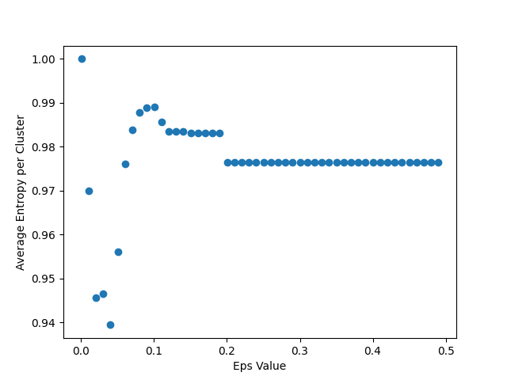
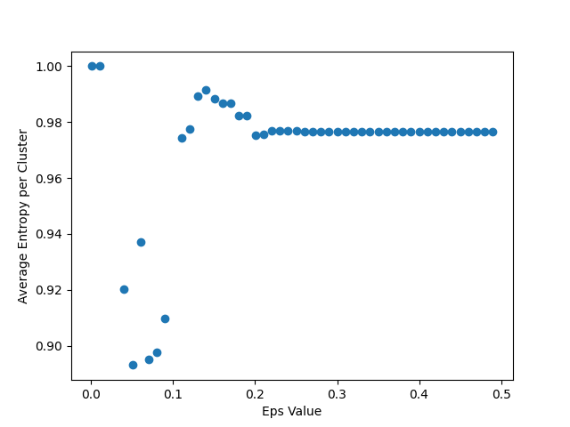
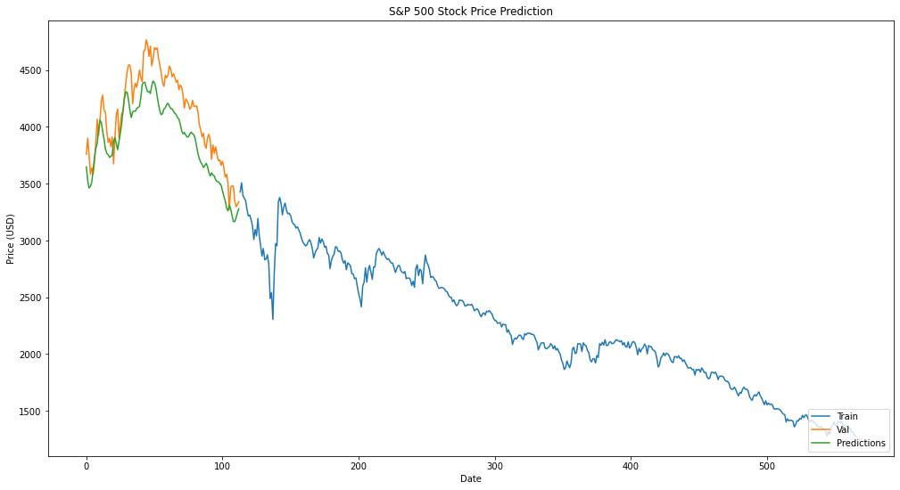
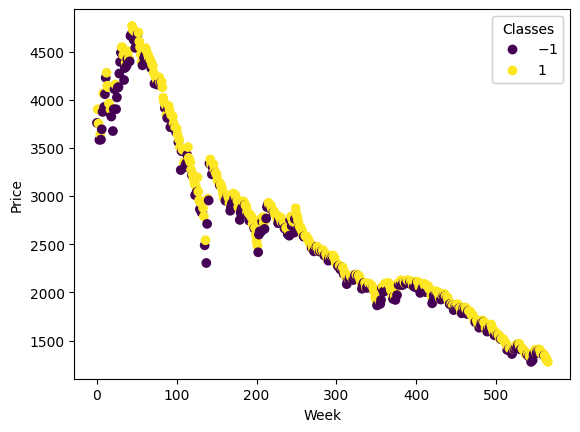
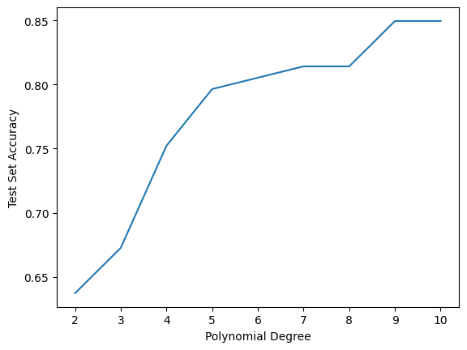
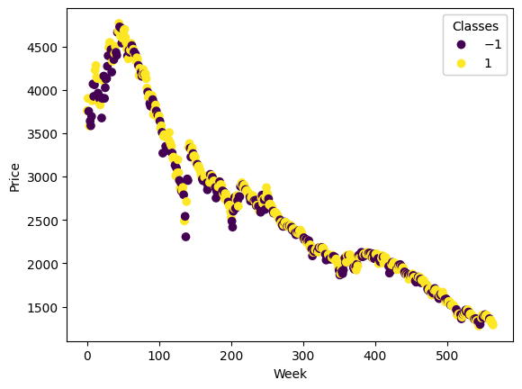
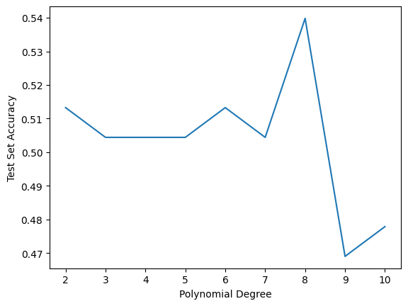
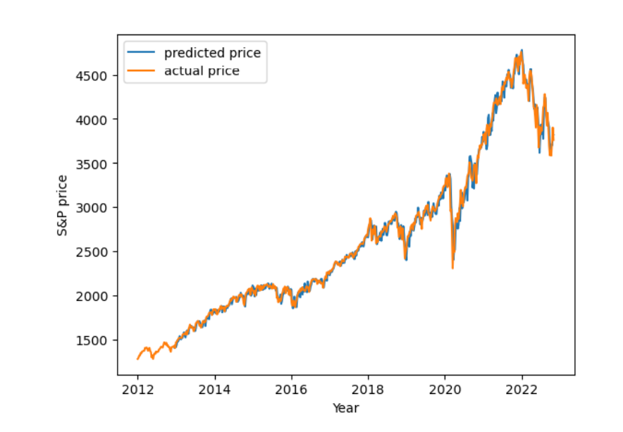

# **Group 84 Final Report**
Jordan Coleman, Aayush Dixit, Prince Fodeke, Elias Izmirlian, Gabriel Montes

## **Introduction/Background**
Machine Learning applied to the stock market is by no means a new area due to the profitability of models that can predict stock prices. Various algorithms have been tested against each other in performance and computational efficiency. In Huang et al. (1) SVM, Linear Discriminant method, Elman Backpropagation Neural Networks and Quadratic Discriminant were compared in their ability to predict financial trends by evaluating weekly trends of the NIKKEI 225 index. The results found that SVM was the most effective and computationally efficient method. In Nabipour et al. (2) multiple algorithms were employed to tackle a similar problem, and the use of a binary representation for the data was compared with a continuous representation. The experiment found that the ensemble achieved up to 67% accuracy in predicting stock trends, whereas with binary data it improved to 83% accuracy. Lastly, Hegazy et al. (3) used Least Squares SVM algorithms integrated with particle swarm optimization to accurately predict stock market prices. This model was compared with a neural network and was found to have better prediction accuracy through the use of multiple financial datasets. While this field has been explored, we hope to gain a better insight on how using machine learning to predict stock prices could directly affect companies in the S&P 500.
The dataset we use contains data on the companies in the S&P 500 over the past few decades. Specifically, some of the features that we plan to use include opening price, closing price, lows, highs, and date. We aim to use this data in order to train a model to predict weekly S&P indices.

## **Problem Definition**
There are many different machine learning and deep learning methods used to predict stocks. We will test several of these methods to determine which will be best in predicting the day to day closing prices of the S&P 500 index, which is regarded by many as the best valuation of the American Stock Market.

## **Data Collection**
The dataset used was sourced from Datahub.io. For our purposes, we pulled a dataset between January 1990 & August 2022 highlighting S&P 500 companies and their opening and closing prices, 52 week highs and lows as well as 52 week change in percent. Training data was broken up 80-20 training and testing data.

## **Methods**
We decided to utilize Support Vector Machines, Elman Backpropagation Neural Networks, and Long Short Term Memory (LSTM) Networks to train our model using the features mentioned above, but upon review decided that LSTMs Networks in combination with DBSCAN would be the most optimal methods to start with. We also used Linear Regression to provide us with another model to compare with these methods and see which produced the most effective result.

### **Data Cleaning**
Cleaning the data mostly involved omitting the data which was irrelevant. The data was reduced to only include the closing prices of the S&P 500 index. This cleaning omits data regarding the weekly maximum, minimum, and opening prices which was included in the csv file which contained the price data.

### **Data Preprocessing**
To prepare the data we first had to import the data from a csv file into a pandas dataframe which was then converted into a numpy array. This numpy array could be more easily handled by the computer by exploiting the parallel processing that is used in numpy. After getting the data into a suitable datatype the data was then partitioned into continuous sets of training data(80% of original) and verification data(20% of original) for LSTM and SVM. For DBSCAN, we also used PCA as a feature selector in order to aid the clustering process. Our PCA implementation fit the data using SVD and transformed it by returning as many principal components needed to retain a certain variance in the dataset. Specifically, for DBSCAN we ran PCA on the dataset after dropping the ‘Date’, ‘Change’, and ‘Vol.’ features in order to be able to cluster accurately. For Linear Regression, in addition to reformatting data to the right datatypes we also reshaped our data to look at the previous 50 days as features to use in making the next day’s prediction. We then created a new array with these prices to use in our linear regression model’s prediction. 

### **Supervised Learning**
For our supervised learning methods, we used LSTM, SVM, and linear regression to see which would produce the better model. 

LSTM models have a “memory”, or the ability to store past information, making them historically successful at stock price prediction. Current and future stock prices are heavily dependent on past stock prices, explaining why LSTM models excel in this domain. The data was taken between January 1990 to August 2022 and was collected from Datahub.io. The data follows an 80-20 training-testing split, and utilizes the root means square error (RSME) metric to evaluate the accuracy of the LSTM Network.

To develop our LSTM model, first we create our LSTM network architecture. This network is developed using open source machine learning library called Tensorflow. 4 different layers in our network architecture are created: 2 with the dimensionality of the output space being 100 units in each one (return_sequence is set to true to have output of equal length), a dense layer with 25 network units, and a dense layer that states the output of a single network unit. The model is then trained by fitting the model to run for 10 epochs with a batch size of 3. Before the model creates its predictions, we have to make some slight changes including merging the training and testing set and reshaping the data. Once the model creates its predictions, we evaluate its performance and visualize the output.

Next, we used SVM to create a competing model. First, we processed the data and our true labels into an 80-20 split for training and testing. In addition to this model, we also tested this method’s ability to predict stock prices by changing our labels to correspond to price changes for the next week. Lastly, we also ran Kernel Soft Margin SVM on the edited data to see if it improved the accuracy of our predictions.

Lastly, we ran Linear Regression on our data to see if it would be able to predict stock prices more accurately given its usefulness in creating predictive models. For this method, we looked at prices 50 days back as features when predicting the price of the next day. We then trained 40% of the data to produce our final dataset which was used in our regression model.

### **Unsupervised Learning**
We also aimed to try to augment this with some kind of clustering method, which could potentially provide us insight into what similarities there are between weeks where the S&P index went up or down, and what kinds of differences there are between the groups. This information could be useful, in turn, in making improvements to our LSTM model, or investigating what other models might be well suited to this problem. Since it was unclear how many clusters might be needed, DBSCAN was the best option. Our goal was to gain insight into the dataset, so it was in our best interest to use the whole It was run on data which was first fit by a PCA algorithm to reduce the dimensionality of the data. The cluster mapping returned was then processed to calculate what percent of the data points in each cluster represented a week where the S&P had an increase in price. These values were used to calculate the entropy for each cluster and the average entropy for the overall clustering. We used this method of evaluation, because ideally many positive samples (weeks where the S&P Index price rose) would be clustered together and many negative samples (weeks where the S&P Index price fell) would be clustered together, as this clustering would provide a lot of support to any of our supervised learning methods.

## **Results/Discussion**

### **Unsupervised Learning- Results and Metrics**
After running DBSCAN multiple times, we were able to cluster our data pretty nicely after using PCA with 1 to 4 principal components, depending on what we set the retained variance value to. Unfortunately, we found the clustering labels were able to give us relatively little information gain into whether a data point in a specific cluster would have a weekly increase or decrease. Knowing that DBSCAN is very parameter sensitive, the algorithm was tested and evaluated using the aforementioned Entropy based methods in order to try to find an ideal epsilon (as this parameter more heavily influences the clustering) for having clusters with the lowest average entropy values. We tested these Epsilon values with a variety of min-neighbors parameters in order to find the optimal conditions. Below are the plots of Average Cluster Entropy as the Epsilon value increases (where min-neighbors is set to 5, which was found to be the value most conducive to information gain). For the plot on the left, the retained variance during PCA is .99, whereas the retained variance during PCA is .99999 for the plot on the left.

 

Interestingly enough, a small increase in the retained variance dramatically improved the average entropy of clusters. This suggests that this kind of clustering method could be utilized better if more information/variance was available for the algorithm to use in the form of additional features (i.e. the models were underfitted). Some improvement would need to occur before this clustering could be of much use, as even at best, the clusters, on average, provide an information gain of around .1 as to whether an additional datapoint would demonstrate an increase or decrease in the S&P 500 Index. The additional features to be added could be a past week’s opening price, high, low, average, or some combination of these, as the previous weeks would definitely influence the coming week. This is something the LSTM model takes into account by nature, which is most likely part of the reason it performs much better.

### **Supervised Learning- Results and Metrics**
The metrics being used to analyze the performance of the LSTM model are Root Mean Squared Error (RMSE) and Mean Absolute Error (MAE). The RMSE value for the model is low at 1.76, indicating that the model has pretty good performance. Below is pictured a plot demonstrating the predicted price of the S&P 500 versus the actual price of the test set. The training set is also pictured. Both sets are plotted with the date (or week the data point represents) as the identifier.

 

This graph further enforces the idea that our LSTM model has pretty strong results so far, which are much more promising than the results of our clustering methods.

Next, for SVM we first needed to determine which kernel would be best to use. We did this by first partitioning our data and true labels and seeing how separable our data was, which produced the following figure:

 

The above figure shows that the data is not very linearly separable, and as a result we decided to use a polynomial kernel for our SVM algorithm. After experimenting with different polynomial degrees, we found that the accuracy for the test set plateaued once the degree reached 9 as shown below:

 

At an accuracy of just below 85%, this method proves to not be the most accurate at predicting stock prices. This is further demonstrated when we shifted our data values and true labels so that the labels correspond to whether a stock price goes up or down for a given week, given by the following figure:

 

We then applied the same SVM with a polynomial kernel which proved to be significantly more inaccurate than the original data as shown:

 

With the accuracy on this new data set ranging around 50%, it is determined that the original unshifted dataset provided a more accurate prediction on stock prices. This makes sense when looking at the graphs showing the separability of the data, since visually it is clear that the original data is more separable. But, since the data wasn’t linearly separable, the higher degree polynomial kernel provided a higher accuracy since it allowed the decision boundary to be more soft and flexible when fitting the data.

Lastly, for Linear Regression we began with a null model to be trained with 40% of the available data, adding prices as far back as 50 days in order to make a prediction. When calculating the RMSE for our model, we found it to be 1227.91 which is unusually high indicating some error in our calculations that, with more time, we would have been able to correct. Below pictured is a plot comparing the predicted price of the model vs the actual price of the training set over a 10 year period.

 

As shown above, the model showed promising results that could be explored further in the future.
	
## **Conclusions**
The problem of stock market prediction is an important issue that could have major implications for many Americans looking to grow their wealth. Our team found this problem to be a challenging and informative experience in applying several machine learning techniques. In general we found that supervised methods, namely SVM, LSTM and Linear Regression produced far more promising results than the unsupervised methods employed. We also found that of the methods employed, LSTM and SVM gave the consistently highest accuracy in predicting stock prices. 

Though our models produced some fairly positive results, we believe we could do better in the future possibly through a dataset with more features as well as exploring a combination of one or more machine learning techniques.

## **Contribution Table**

| Team Member      | Contribution   |
|:----------|:----------|         
| Elias Izmirlian  | Implementation of SVM |     
| Aayush Dixit  | Updated methods and results |
| Jordan Coleman| Created final video presentation |
| Gabe Montez  | Implementation of Linear Regression|
| Prince Fodeke  | Updated results and conclusion |

## **References**
1. W. Huang, Y. Nakamori and S.-Y. Wang, "Forecasting stock market movement direction with support vector machine", Comput. Oper. Res., vol. 32, no. 10, pp. 2513-2522, Oct. 2005.
2. Nabipour, M., Nayyeri, P., Jabani, H., S., S., & Mosavi, A. (2020). Predicting stock market trends using machine learning and deep learning algorithms via continuous and binary data; a comparative analysis. IEEE Access, 8, 150199–150212. https://doi.org/10.1109/access.2020.3015966 
3. Hegazy, O., Soliman, O. S., & Salam, M. A. (2014). A machine learning model for stock market prediction. arXiv preprint arXiv:1402.7351.

